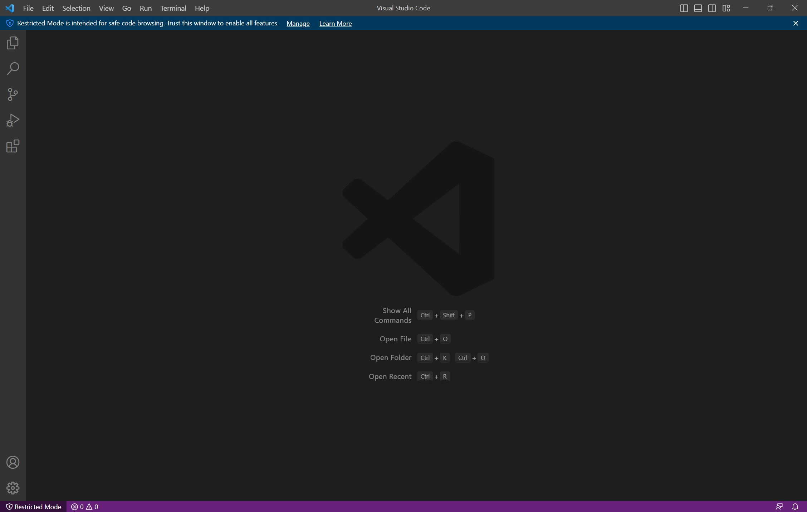
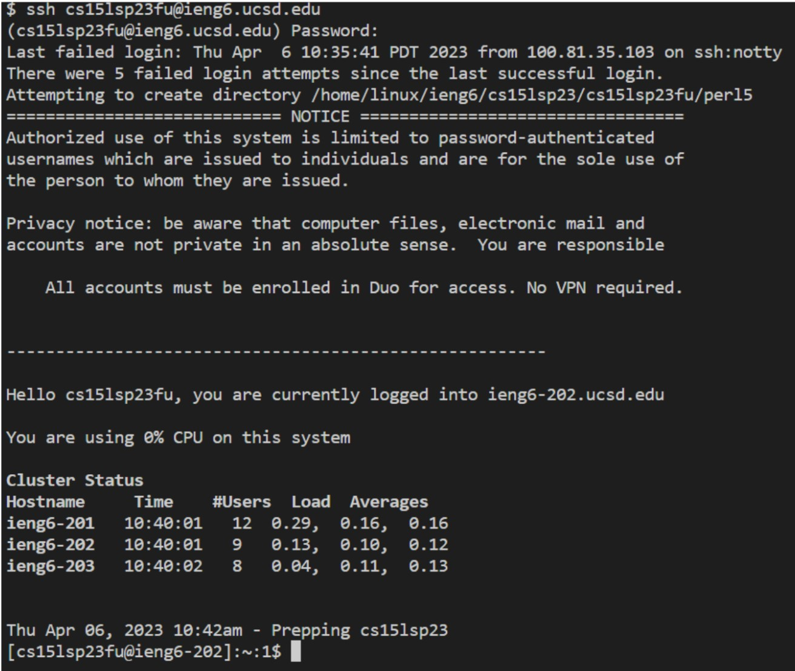
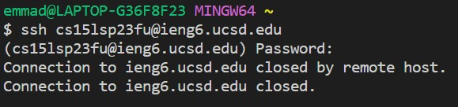
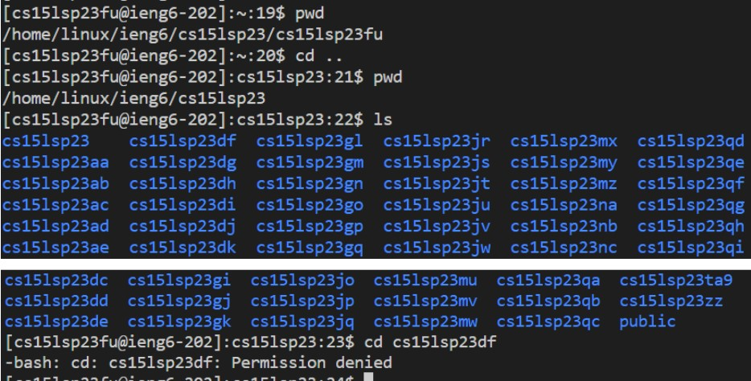

# Lab Report 1
## Remote Access and FileSystem
Author: Emma Dunmire

Date: 4/10/2023

**Installing VScode**

I did not install VScode during the lab, since I had already installed it in a previous course.

When opening VScode, the page that should appear will look like the image below.

*Steps for connecting bash to VScode*
1. Install git.
> P.S. to self - You have to go beyond just clicking the download button. To install, click the file, allow it to make changes to your device, and go through the system setup until the actual 'install' button appears.
Click install. Then you should be good to go. You forgot to do that during the lab.
2. Open VScode. (If you already had it open, close it then reopen it.) Hit Ctrl + Shift + P, then type 'Select Default Profile' then select git bash.
> Tip: 
> 
> Ctrl + ` to open new terminal
>
> Ctrl + D to close

**Remotely Connecting**

In the terminal, select bash, then type 'ssh cs15lsp23zz@ieng6.ucsd.edu' (zz in place for my two unique characters)
which will then pull up a password prompt. *Note: when typing in the password nothing appears, but you still are typing something. It's just hiding
it for privacy.* It should then pull up a page confirming that you're logged in. Strangely, when I did this in lab it worked fine. Now, it's not working properly
and it closes me out.

When it worked:

Now when it doesn't:

**Trying Some Commands**
During the lab, I tried figuring out what directory I was in by doing pwd. Then I found that if I went to the outer folder (..), I could see all the usernames for other students. I tried opening another random student's folder and happily discovered that I don't have permissions for that.

