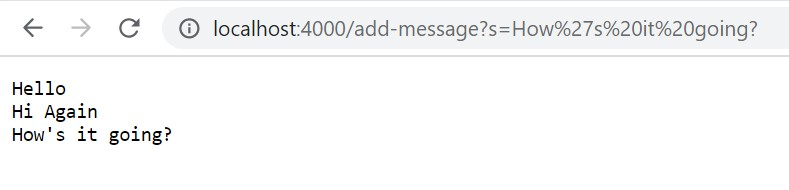

# Lab Report 2 #

## Servers and Bugs ##

Author: Emma Dunmire

Date: 4/20/23

**Part 1**

The Code For StringServer
```
import java.io.IOException;
import java.net.URI;
import java.util.ArrayList;

class Handler implements URLHandler {
    String str = "";

    public String handleRequest(URI url) {
        if (url.getPath().equals("/")) {
            return "Page Is Open\n Add a string to begin";
        }
        else {
            System.out.println("Path: " + url.getPath());
            if (url.getPath().contains("/add-message")) {
                String[] parameters = url.getQuery().split("=");
                if (parameters[0].equals("s")) {
                    str += parameters[1] + "\n";
                    return String.format("%s", str);
                }
            }
            return "404 Not Found!";
        }
    }
}

class StringServer {
    public static void main(String[] args) throws IOException {
        if(args.length == 0){
            System.out.println("Missing port number! Try any number between 1024 to 49151");
            return;
        }

        int port = Integer.parseInt(args[0]);

        Server.start(port, new Handler());
    }
}
```

---


When `add-message?s=Hi Again` is entered as a request, the handleRequest method in the Handler class is called. The value for the `url` parameter is the entire url.
Since the path for the url is not just a slash, the program checks if the url path is `/add-message` (which it is) and then will run the if-statement. Inside the if-statement,
the query gets split at the equals sign into an array containing two elements (one is s and the other is the inputted string). It will then add the inputted string to the
running string with an additional new line (`/n`) at the end and then output it as the return value.

---



Similar to previous example, `add-message?s=How are you?` is the request, which alters the `url` parameter. Though the path will remain the same, the query changes from `s=Hi Again`
to `s=How are you?`. Calling the handleRequest method again, this time it will run through the same if-statements but will concatanate the string "How are you?" onto the previous
string. Now str will contain "Hello\nHi Again\nHow are you?\n" which will get output as the return value to the handleRequest method.

**Part 2**

I chose to examine the method *reversed()* in the ArrayExamples file.

A failure inducing test was

```
@Test
  public void testReversed2() {
    int[] input = {0,1,2,3,4};
    assertArrayEquals(new int[]{4,3,2,1,0}, ArrayExamples.reversed(input));
  }
```

A test that did not produce a failure was

```
@Test
  public void testReversed_OneVal() {
    int[] input = {0};
    assertArrayEquals(new int[]{0}, ArrayExamples.reversed(input));
  }
```

The symptom ended up being that, at the first element of the array, the value ended up being 0 when it should have been 4 (as seen in the screeenshot below).


Buggy code:

```
static int[] reversed(int[] arr) {
    int[] newArray = new int[arr.length];
    for(int i = 0; i < arr.length; i += 1) {
      arr[i] = newArray[arr.length - i - 1];
    }
    return arr;
  }
```

Functional code:

```
static int[] reversed(int[] arr) {
    int[] newArray = new int[arr.length];
    for(int i = 0; i < arr.length; i += 1) {
      newArray[i] = arr[arr.length - i - 1];
    }
    return newArray;
  }
```

Flipping which array was getting updated prevented all of `arr`'s values from being overwritten by the null values in the `newArray`. This change allows `arr`'s values to be transferred to `newArray` in reverse order, like the method is intended to do. Also, the method is supposed to output a new array, not the inputted array. This means that the return value had to be changed from `arr` to `newArray` in the last line of code.

**Part 3**

Before taking this class, I did not understand at all how URLs worked. The extent of my knowledge was that they were unique to a certain location and that they could be shared between people so that everyone can find what they need to. It is very interesting to learn the different parts to a URL (such as the domain, path, query, etc.) and that the different parts work similarly to commands that are unique to a domain. It makes me wonder why some URLs are so much longer than others and what all that text provides in terms of information about the page and how much of it is information about the person visiting the page.
