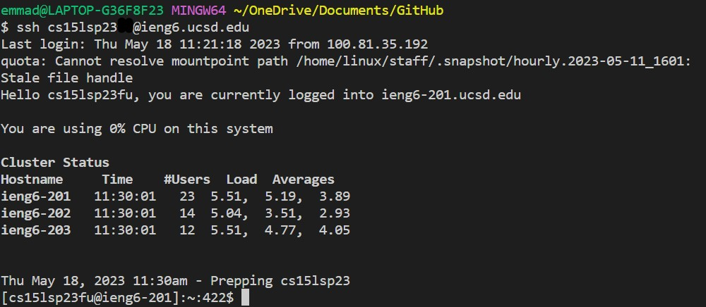
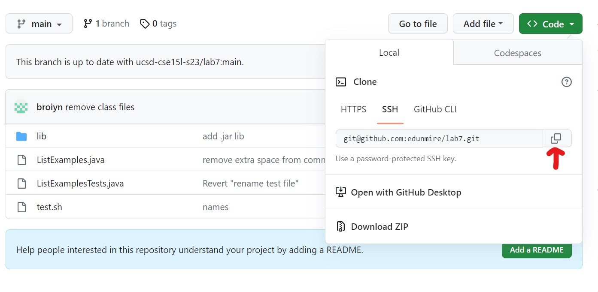
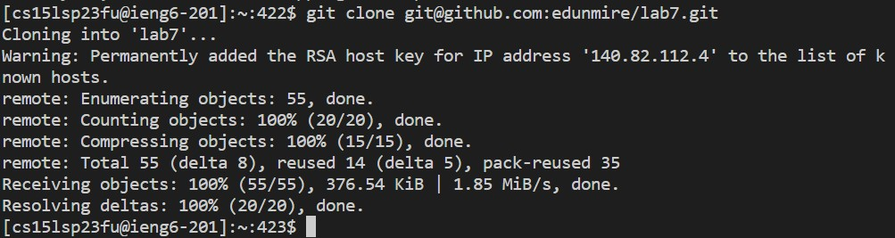
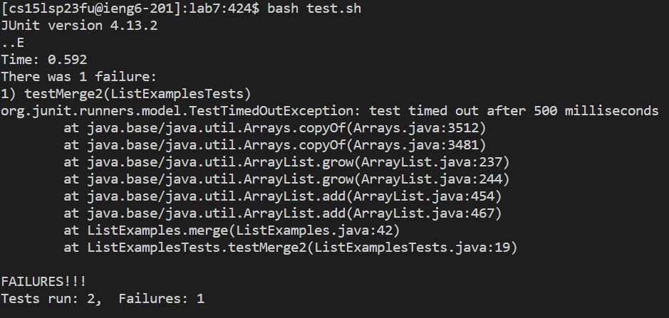
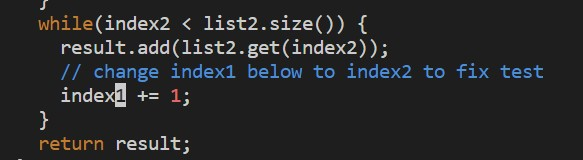
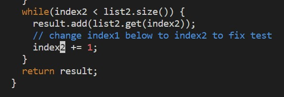
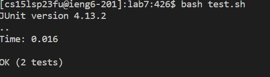
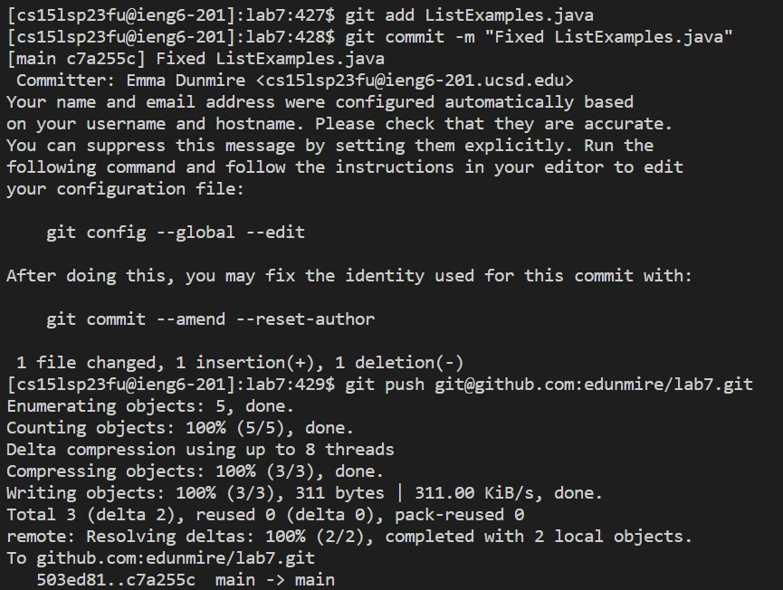

## Lab Report 4

# From the Command Line

Author: Emma Dunmire

Date: 5/18/2023

**Task 1: Log into ieng6**

Typed `ssh cs15lsp23__@ieng6.ucsd.edu<enter>`. Because of the ssh key setup, I did not have to enter a password and was able to immediately login in to the remote computer.

**Task 2: Clone your fork of the repository from your Github account**

Got the ssh link for the repository.

Typed `git clone <Ctrl+V><enter>`. To paste copied link and clone it. And then, the confirmation that the repository was cloned appeared in the terminal.

**Task 3: Run the tests, demonstrating that they fail**

To run the tests, I typed `cd lab7<enter>` to get to the correct directory, then `bash test.sh<enter>`which then produced the error message
that one of the tests failed.

**Task 4: Edit the code file ListExamples.java to fix the failing test**

In order to fix the code in ListExamples.java, I typed `vim ListExamples.java<enter>` and entered vim.
The cursor was already in the correct position (if it wasn't I would have typed either `/index1` and `n` or use h,j,k,l keys to get to the desired place).
I typed `xi2<esc>` to remove the 1, enter INSERT mode, replace it for 2, and then return to NORMAL mode. I then typed `:wq` to save and exit the file.

**Task 5: Run the tests, demonstrating that they now succeed**

To run the tests I typed `<up><up><enter>` since it was already in my command line history. The tests then ran successfully.

**Task 6: Commit and push the resulting change to your Github account**

`git add ListExamples.java<enter>`
`git commit -m "Fixed ListExamples.java<enter>"`
`git push <Ctrl+V><enter>`

