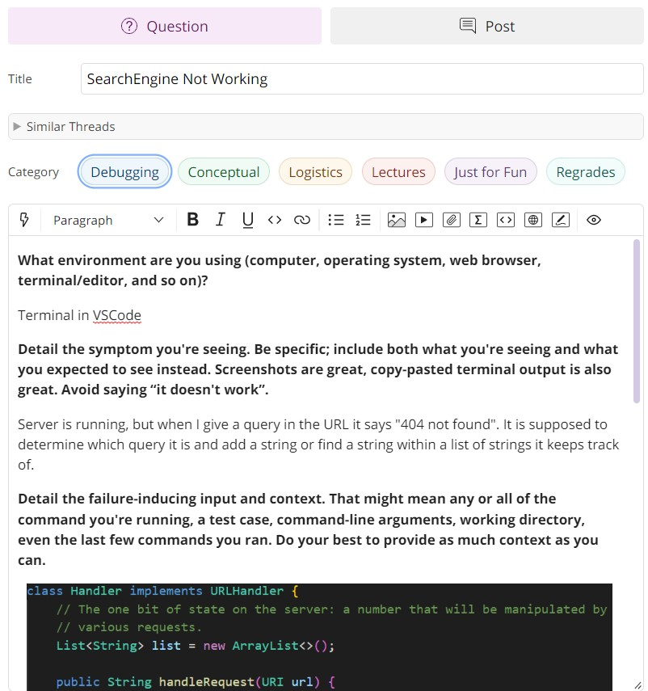
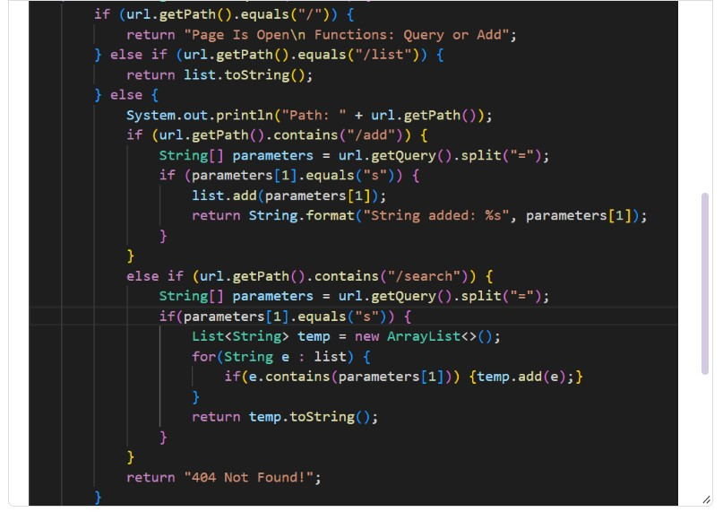
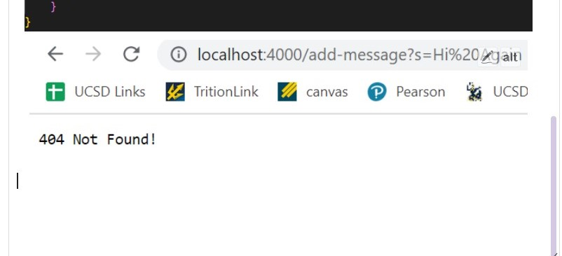
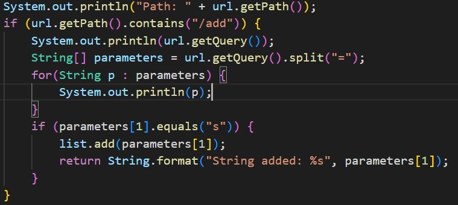
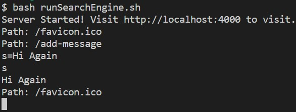

# Lab Report 5

## Debugging

Author: Emma Dunmire

Date: 6/1/23

**EdStem Debugging**

*Screenshots of the student's edStem post.*







*Possible response from the TA:*

Have you checked that the query is what you expect? Try placing a print line to see if the query and parameters contain what you're looking for.

*Student Testing*





It seems that query and parameters contain what I expected. Based on this, it means that my variables are containing the correct information but my if-statement is not running correctly. I checked closer and realized I should be comparing `parameters[0]` instead of `parameters[1]` to the query.

**Setup Of Student's Code**
File/Directory Structure

```
/wavelet
  /SearchEngine.java
  /Server.java
  /RunSearchEngine.sh
```

Contents of SearchEngine.java
```
import java.io.IOException;
import java.net.URI;
import java.util.ArrayList;
import java.util.Arrays;
import java.util.List;

class Handler implements URLHandler {
    // The one bit of state on the server: a number that will be manipulated by
    // various requests.
    List<String> list = new ArrayList<>();

    public String handleRequest(URI url) {
        if (url.getPath().equals("/")) {
            return "Page Is Open\n Functions: Query or Add";
        } else if (url.getPath().equals("/list")) {
            return list.toString();
        } else {
            System.out.println("Path: " + url.getPath());
            if (url.getPath().contains("/add")) {
                System.out.println(url.getQuery());
                String[] parameters = url.getQuery().split("=");
                for(String p : parameters) {
                    System.out.println(p);
                }
                if (parameters[1].equals("s")) {
                    list.add(parameters[1]);
                    return String.format("String added: %s", parameters[1]);
                }
            }
            else if (url.getPath().contains("/search")) {
                System.out.println(url.getQuery());
                String[] parameters = url.getQuery().split("=");
                for(String p : parameters) {
                    System.out.println(p);
                }
                if(parameters[1].equals("s")) {
                    List<String> temp = new ArrayList<>();
                    for(String e : list) {
                        if(e.contains(parameters[1])) {temp.add(e);}
                    }
                    return temp.toString();
                }
            }
            return "404 Not Found!";
        }
    }
}

class SearchEngine {
    public static void main(String[] args) throws IOException {
        if(args.length == 0){
            System.out.println("Missing port number! Try any number between 1024 to 49151");
            return;
        }

        int port = Integer.parseInt(args[0]);

        Server.start(port, new Handler());
    }
}
```

Contents of Server.java
```
import java.io.IOException;
import java.io.OutputStream;
import java.net.InetSocketAddress;
import java.net.URI;

import com.sun.net.httpserver.HttpExchange;
import com.sun.net.httpserver.HttpHandler;
import com.sun.net.httpserver.HttpServer;

interface URLHandler {
    String handleRequest(URI url);
}

class ServerHttpHandler implements HttpHandler {
    URLHandler handler;
    ServerHttpHandler(URLHandler handler) {
      this.handler = handler;
    }
    public void handle(final HttpExchange exchange) throws IOException {
        // form return body after being handled by program
        try {
            String ret = handler.handleRequest(exchange.getRequestURI());
            // form the return string and write it on the browser
            exchange.sendResponseHeaders(200, ret.getBytes().length);
            OutputStream os = exchange.getResponseBody();
            os.write(ret.getBytes());
            os.close();
        } catch(Exception e) {
            String response = e.toString();
            exchange.sendResponseHeaders(500, response.getBytes().length);
            OutputStream os = exchange.getResponseBody();
            os.write(response.getBytes());
            os.close();
        }
    }
}

public class Server {
    public static void start(int port, URLHandler handler) throws IOException {
        HttpServer server = HttpServer.create(new InetSocketAddress(port), 0);

        //create request entrypoint
        server.createContext("/", new ServerHttpHandler(handler));

        //start the server
        server.start();
        System.out.println("Server Started! Visit http://localhost:" + port + " to visit.");
    }
}
```

Contents of RunSearchEngine.sh
```
javac SearchEngine.java Server.java
java SearchEngine 4000
```

To run the bug, I typed `bash RunSearchEngine.sh` in the terminal and then opened the server. I altered the URL to contain the query `/add-message?s=Hi Again` and received the "404 Not Found!" output.

To fix the bug, change the if-statements `parameters[1].equals("_")` in SearchEngine.java to `parameters[0].equals("_")`. Then the if-statements will be comparing the right arguments.
